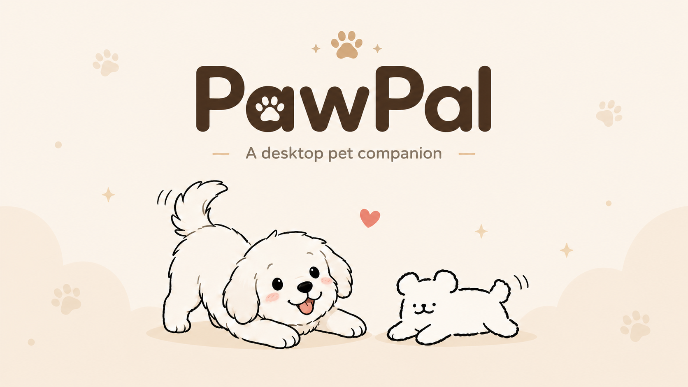

<p align="center">
  
</p>

<h1 align="center">Domi</h1>

<p align="center">
  一只住在你桌面上的小狗，提醒你休息、喝水、保持专注。
</p>

<p align="center">
  <a href="https://github.com/zlong6943-commits/Domi/releases"></a>
  
  
  
</p>

<p align="center">
  <a href="#中文">中文</a> · <a href="#english">English</a>
</p>

## 中文

Domi 是一个面向 macOS 的桌面宠物应用。一只透明、始终置顶的小狗会陪在你的屏幕上，在你久坐、忘记喝水或者分心刷社交媒体时，温柔地把你带回节奏里。

## 功能

- **休息提醒** — 定时提醒你站起来活动一下，小狗会跑过整个屏幕引起你的注意
- **喝水提醒** — 别忘了喝水
- **专注模式** — 检测你当前在用的 app，如果你在刷社交媒体，小狗会来提醒你回去工作
- **自动散步** — 没有提醒任务时，小狗会在当前屏幕上随机挑选位置自己走动
- **定时伸懒腰** — 每隔 10 分钟自动播放一次约 5 秒的伸懒腰动作
- **三连击扑球** — 在任意位置快速同点点击三次，小球会飞出来，小狗会追过去扑住它
- **专属宠物形象** — 内置由宠物照片生成的“我的小狗”，包含统一绘本风格的透明插画和 9 个核心动作
- **多种宠物外观** — 内置“我的小狗”、线条小狗、金毛 puppy 和小鸡毛
- **中文 / English** — 支持中英文切换
- **完全本地运行** — 设置、统计和宠物素材都保存在本机；应用不要求、读取或保存任何 API Key

### 专属宠物素材

本项目已经内置一套由宠物照片生成的素材，无需在应用里上传照片或配置 API。打开“设置 → 外观”，选择“我的小狗”即可使用。

九个核心动作分别用于默认、开心、休息提醒、伸懒腰、喝水提醒、睡觉、走路、跑步和扑球。走路与跑步都采用六张真实姿势帧：腿部交替、身体重心和腾空阶段会逐帧变化，不再依赖整张图片上下晃动。没有单独制作的状态按固定规则复用最接近的核心素材。

Git 仓库包含应用运行所需的全部动画和提示词。体积较大的生图过程稿、动作拆帧与透明化中间文件收录在每个版本 Release 的 `full-source` 压缩包中。

## 安装

### 下载安装包（推荐）

从 [Releases](../../releases) 页面下载对应 Mac 的安装包：

| 文件 | 适用设备 |
|------|---------|
| `Domi-x.x.x-arm64.dmg` | macOS Apple Silicon (M系列芯片) |
| `Domi-x.x.x-x64.dmg` | macOS Intel |
> **macOS**：首次打开时可能提示"无法验证开发者"，请在 系统设置 → 隐私与安全性 中允许打开。专注模式的分心检测需要授予 Accessibility 权限。

### 从源码运行

需要 Node.js 24+、pnpm 11 和 Xcode Command Line Tools。推荐通过 Corepack 启用 pnpm（版本以 `package.json` 的 `packageManager` 为准）：

```bash
corepack enable
git clone https://github.com/zlong6943-commits/Domi.git
cd Domi
pnpm install
pnpm dev
```

如果 `corepack enable` 没有权限，请用其他方式安装 pnpm 11，并确认 `pnpm --version` 可以正常运行。

## 构建

```bash
pnpm test         # 运行纯逻辑测试
pnpm build        # 编译（含类型检查）
pnpm dist         # 编译 + 打包 macOS
pnpm dist:mac     # 编译 + 打包 macOS
```

> 本地打包时请确保 `pnpm` 命令可以在 shell 中直接运行；electron-builder 会用它收集依赖。

## 技术栈

- Electron + electron-vite
- React 19 + TypeScript
- electron-store（本地持久化）
- electron-builder（打包分发）

## 项目结构

```
src/main/       主进程：窗口管理、提醒逻辑与本地持久化
src/preload/    IPC 桥接层
src/renderer/   React UI（宠物窗口 + 设置窗口）
src/shared/     共享类型、默认配置、i18n、宠物外观定义
tests/          纯逻辑测试
pet_assets/     内置宠物动画素材（GIF / 透明 APNG）
```

## 开发路线

- [ ] 更多宠物外观
- [ ] 声音效果
- [ ] 多显示器适配优化

## 许可

源代码基于 [MIT License](LICENSE)。宠物动画素材有独立的授权说明，详见 [ASSET_LICENSE.md](ASSET_LICENSE.md)。

---

## English

A tiny desktop dog that helps you pause before you burn out.

Domi is a desktop pet app for macOS. A transparent, always-on-top dog lives on your screen and gently reminds you to take breaks, drink water, and stay focused.

### Features

- **Break reminders** — timed nudges to get up and move; the dog runs across your screen to get your attention
- **Hydration reminders** — don't forget to drink water
- **Focus mode** — detects what app you're using; if you're on social media, the dog will nudge you back to work
- **Automatic roaming** — the dog picks new places to walk to while no reminder is active
- **Ten-minute stretch** — a five-second stretch plays every ten minutes when the dog is free
- **Triple-click ball play** — rapidly click the same spot three times to throw a ball for the dog to chase and pounce on
- **Personal pet character** — includes a photo-derived illustrated dog with nine core motions
- **Multiple pet styles** — My Dog, Line Dog, Golden Puppy, and Xiao Ji Mao
- **Chinese / English UI**
- **Fully local runtime** — settings, statistics, and pet assets stay on your Mac; the app never asks for, reads, or stores an API key

Open Settings → Appearance and select **My Dog**. The included animation set covers Idle, Happy, Break Prompt, Stretching, Hydration Prompt, Sleeping, Walking, Running, and Pouncing. Walking and Running each use six genuinely different body poses instead of moving one static drawing; related states reuse the closest matching local animation.

The Git repository includes every runtime asset and the prompt template. Large generation source images, extracted frames, and transparency intermediates are provided in each Release's `full-source` archive.

### Install

Download the latest macOS `.dmg` from [Releases](../../releases), or run from source:

```bash
corepack enable
git clone https://github.com/zlong6943-commits/Domi.git
cd Domi
pnpm install
pnpm dev
```

Source builds require Node.js 24+, pnpm 11 (see `packageManager` in `package.json`), and Xcode Command Line Tools for the local macOS mouse monitor. Make sure the `pnpm` command is available in your shell before packaging, because electron-builder uses it while collecting dependencies.

If `corepack enable` does not have permission to install shims, install pnpm 11 another way and verify that `pnpm --version` works.

Common commands:

```bash
pnpm test
pnpm build
pnpm dist
```

### License

Source code under [MIT License](LICENSE). Pet animation assets have separate licensing; see [ASSET_LICENSE.md](ASSET_LICENSE.md).
